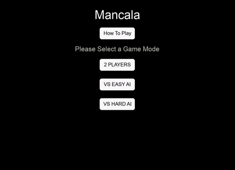

# Mancala Game

The classic game Mancala, implemented using Python, a Graphical User Interface built with Pygame, and features an AI opponent that utilizes the minimax algorithm.

- Mancala is a two-player strategy game that involves moving stones (seeds) across pits on a board. The objective of the game is to capture more seeds than the opponent.
- Run `main.py` to start the game.

## Requirements

- Python 3.x
- Pygame library
